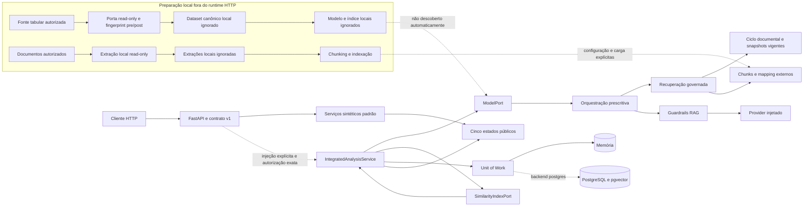
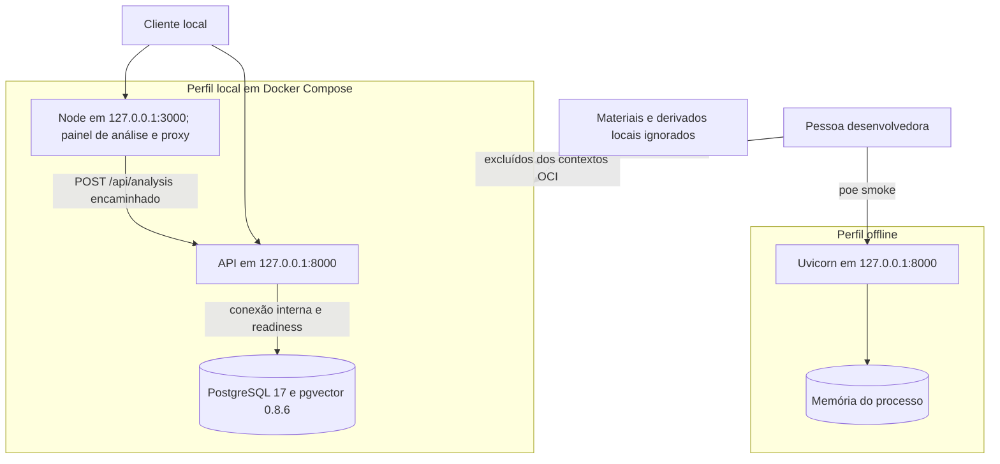
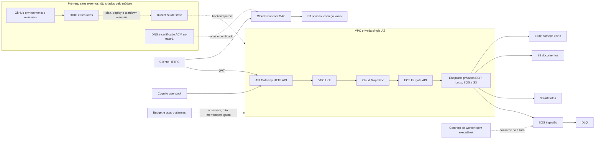

# Diagramas da arquitetura atual

- Baseline documental: `origin/develop` em `7a05487`
- Data de referência: 2026-08-23
- Escopo: componentes versionados, incluindo o painel de análise servido por
  `apps/web`; capacidades ainda não integradas não estão representadas

As setas contínuas representam o caminho executável no contexto indicado.
Setas tracejadas representam uma composição disponível somente por injeção ou
um recurso declarativo ainda não aplicado. “Local” e “AWS” são perfis
diferentes; o diagrama AWS não descreve o ambiente Compose.

## Diagrama lógico

O caminho sólido `API → serviços sintéticos` é o runtime entregue por padrão.
A composição integrada é código executável e testado, mas nenhum dataset,
modelo, índice, mapping documental ou provider real é descoberto ou autorizado
automaticamente. O resultado público nunca transporta feature, texto
documental, prompt ou output bruto.

## Diagrama local

No perfil offline, a readiness não consulta dependências externas. No Compose,
as três portas host ficam presas a loopback; API e web usam filesystem raiz
read-only, `/tmp` efêmero, nenhuma capability Linux e
`no-new-privileges`. O serviço web responde à liveness, serve o painel e
encaminha somente `POST /api/analysis` para a API, de modo que o navegador
permanece na mesma origem da página. O smoke não inicia nem encerra
contêineres.

## Diagrama AWS

> Estado: **planejado e validado offline**. Nenhum bloco abaixo comprova recurso
> existente, conta configurada ou execução live.

O plano offline auditado contém 73 recursos com ação `create` e usa
`api_desired_count = 0` na fundação. Não há NAT, Internet Gateway, ALB, banco
gerenciado, worker, UI, WAF, alta disponibilidade ou multi-região. Bedrock fica
desabilitado por padrão e habilitá-lo não conecta o adapter Python
automaticamente.

A fonte canônica do perfil é o
[perfil Terraform AWS demo](../../infra/aws/demo/README.md). Estado da prova,
inventário, estimativa e pendências live estão na
[validação AWS](../validation/aws-demo-evidence.md).

## O que os diagramas não prometem

- qualidade preditiva ou semântica;
- aprovação automática de manutenção;
- upload e armazenamento de bytes pela API;
- autenticação no runtime local;
- gestão documental, histórico de análises ou autenticação no painel web;
- deploy ou operação AWS;
- equivalência entre fakes de CI e um provider real.

O [inventário de arquitetura](README.md) é a referência detalhada de componentes
e limites; mudanças futuras devem atualizar os diagramas somente depois de
integradas.
