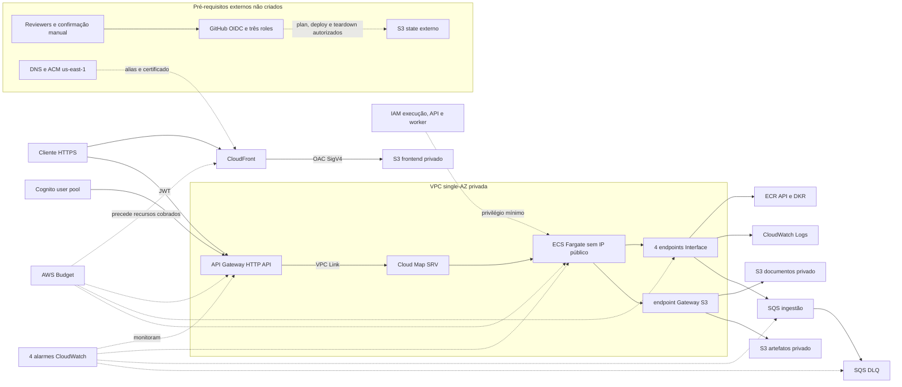

# Perfil AWS demo

Este diretório define, sem executar `apply`, um único perfil Terraform efêmero
para demonstrar a API e a fronteira web autenticada na AWS. A configuração é
deliberadamente single-AZ, não cria banco e não tenta representar produção.

O run `32725423445` confirmou preflight e OIDC da operação de plan, mas o
controlador recusou a expiração JSON-string antes do Terraform. State e Budget
permaneceram ausentes; não houve plan remoto, `apply` ou deploy. A SEN-82 corrige
esse limite e mascara account ID, bucket de state, certificado e role por segredos
(`secrets`) do environment, sem executar nova tentativa live.

Nos workflows, região, AZ e domínio permanecem variáveis (`vars`); account ID,
bucket de state, certificado e a role exclusiva da operação são secrets, assim
como o e-mail do Budget e o token de smoke. Nenhum secret alcança checkout,
preflight ou preparação anterior à action OIDC; cada step recebe somente as
referências necessárias.

Versões fixadas:

- Terraform `>= 1.15.9, < 1.16.0`;
- provider `hashicorp/aws` `6.61.0`, registrado em `.terraform.lock.hcl`.

Pré-requisito explícito para uma execução real: um domínio DNS próprio e um
certificado público ACM já emitido e validado em `us-east-1`, na mesma conta e
com SAN que cubra exatamente esse domínio. O perfil recebe ambos por
`frontend_domain_name` e `frontend_certificate_arn`; ele não cria certificado,
hosted zone nem registro DNS. Depois do apply autorizado, o responsável aponta o
domínio para `frontend_distribution_domain_name` seguindo o procedimento do
provedor DNS. O exemplo usa somente `demo.example.invalid` e um ARN fictício e
não habilita nenhum controle offline. Em uma execução direta, os defaults
`offline_validation = false` e nonce ausente fazem as preconditions rejeitarem
esses placeholders antes da criação de recursos AWS.

## Arquitetura escolhida



A confrontação reproduzível entre esse diagrama, o plano de 75 recursos e os
gates da SEN-68, incluindo a evidência live parcial da SEN-82, está no
[relatório de validação AWS](../../../docs/validation/aws-demo-evidence.md).

A API da SEN-49 é um servidor Uvicorn OCI comum, com processo não privilegiado,
porta `8000` e healthcheck HTTP. Por isso o compute é ECS Fargate: ele executa a
imagem por digest sem converter o artefato em imagem Lambda nem adicionar um
runtime adapter inexistente. O API Gateway usa integração HTTP privada por VPC
Link e Cloud Map; a documentação AWS exige registros com IP e porta quando ECS
preenche o serviço, atendidos aqui por service discovery `SRV`.

A task fica em subnet privada, sem Internet Gateway, NAT ou IP público. Os pulls
do ECR usam endpoints privados `ecr.api` e `ecr.dkr` mais o gateway endpoint S3;
logs e o contrato de fila usam endpoints privados próprios. Essa escolha custa
mais por hora que uma task com IPv4 público, mas mantém o compute realmente
privado e ainda cabe na janela curta da demo. Não há ALB: o Cloud Map elimina
esse custo e essa camada operacional.

O bucket do frontend é uma origem S3 normal e privada, nunca um website endpoint.
Somente o principal `cloudfront.amazonaws.com`, condicionado ao ARN da distribuição
e à conta, recebe `s3:GetObject`; o OAC assina todas as requisições com SigV4. Os
três buckets bloqueiam acesso público, impõem Object Ownership, SSE-S3 e
versionamento. `force_destroy` e a expiração de versões não correntes existem
somente porque este perfil é removível.

A fundação nasce sem objetos no bucket frontend. O dispatch protegido de runtime
faz staging pela allowlist exata de `apps/web/src`, publica módulos ESM imutáveis,
gera o `runtime-config.v1.json` público a partir dos outputs do mesmo state e envia
o `index.html` por último. Depois remove apenas assets residuais já validados,
invalida a distribuição, espera `Completed` e executa o smoke pela URL final.

O viewer HTTPS não usa o certificado padrão do CloudFront. A AWS fixa esse
fallback em `TLSv1` mesmo quando a configuração declara outra política; por isso
o perfil exige alias próprio, certificado ACM de `us-east-1`, SNI e
`TLSv1.2_2021`, sem caminho alternativo para o certificado público legado.

O `$default` do API Gateway exige o authorizer JWT do Cognito; a rota explícita
`OPTIONS /{proxy+}` usa `authorization_type = "NONE"` para o preflight. O client
Cognito é público (`generate_secret = false`), mantém o fluxo administrativo usado
pelo smoke efêmero e oferece ao navegador somente OAuth Authorization Code com
PKCE. Callback e logout apontam para a raiz HTTPS exata. CORS aceita exclusivamente
o domínio HTTPS próprio informado e coberto pelo certificado; não há `*` para
origem, headers ou métodos.

## Limites coerentes com o código atual

O backend exige configuração explícita no startup. A task declara
`PRESCRIPTIVE_MAINTENANCE_ENVIRONMENT=aws` e
`PRESCRIPTIVE_MAINTENANCE_PERSISTENCE_BACKEND=memory`, além de
`PRESCRIPTIVE_MAINTENANCE_ANALYSIS_MODE=synthetic_demo`; esse perfil rejeita uma
`PRESCRIPTIVE_MAINTENANCE_DATABASE_URL`, portanto o Terraform não inventa uma
URL PostgreSQL e não cria Aurora, RDS ou pgvector. A readiness em
`/health/ready` não consulta dependência externa quando o backend é `memory` e é
o gate de saúde do ECS, com corpo exato `{"status":"ready"}`. A liveness em
`/health/live` verifica somente o processo e não decide se a task pode receber
tráfego. Todas as rotas que chegam pelo API Gateway, inclusive os endpoints de
health, exigem JWT; a sondagem do ECS ocorre internamente em loopback.

O ECR nasce vazio. `api_desired_count = 0` permite criar a fundação sem tentar
executar um digest ausente. Depois que a imagem real construída pelo Dockerfile
da SEN-49 for enviada ao repositório, um plano posterior informa o digest
`sha256:...` e muda a contagem para `1`. Publicação e automação de deploy não
fazem parte da SEN-67; a SEN-68 acrescenta o fluxo manual protegido descrito em
[`delivery/README.md`](delivery/README.md). Somente preflight e OIDC de plan foram
exercitados live; o Terraform ainda não foi iniciado.

SQS, DLQ e `worker-contract.v1.json` definem a fronteira assíncrona mínima. Uma
mensagem referencia uma versão imutável do objeto e seu SHA-256; o consumidor
deve ser idempotente por `job_id`, validar o schema, ler exatamente a versão
indicada, gravar derivados sob `artifact_prefix` e só então apagar a mensagem.
Após três recebimentos sem sucesso ela segue para a DLQ. A role
`worker_task_role_arn` permite somente receber/alterar visibilidade/apagar nessa
fila, ler documentos e gravar artefatos. Nenhum worker executável existe hoje,
portanto criar um serviço ou sobrescrever o comando da imagem da API inventaria
compatibilidade e ficou deliberadamente fora do plano.

Exemplo inteiramente sintético de mensagem:

```json
{
  "schema_version": "worker-message.v1",
  "job_id": "job_synthetic0001",
  "enqueued_at": "2026-08-23T12:00:00Z",
  "document": {
    "bucket": "senai-pm-documents-000000000000-us-east-1",
    "key": "synthetic/manual-demo.pdf",
    "version_id": "version_synthetic_01",
    "sha256": "aaaaaaaaaaaaaaaaaaaaaaaaaaaaaaaaaaaaaaaaaaaaaaaaaaaaaaaaaaaaaaaa"
  },
  "artifact_prefix": "synthetic/jobs/job_synthetic0001/"
}
```

O Bedrock permanece desabilitado. `enable_bedrock = true` exige um model ID
explícito e acrescenta somente `bedrock:InvokeModel` para o ARN desse foundation
model e um endpoint `bedrock-runtime`. Isso não conecta automaticamente o
adapter Python: o código atual ainda exige uma factory de cliente injetada.

## Estado remoto sem credenciais

O bloco `backend "s3" {}` é parcial. O bucket de state deve existir antes deste
perfil, ser privado, criptografado e versionado, e ter ciclo de vida próprio; ele
não é criado nem removido por esta configuração. O exemplo
`backend.demo.hcl.example` usa conta e nome fictícios e ativa lock nativo do S3
por `use_lockfile`, sem DynamoDB depreciado.

Para validação local, o backend é desabilitado:

```powershell
terraform -chdir=infra/aws/demo init -backend=false
terraform -chdir=infra/aws/demo validate
```

Para uma execução autorizada futura, mantenha o arquivo real fora do repositório
e passe apenas seu caminho:

```powershell
terraform -chdir=infra/aws/demo init -reconfigure `
  -backend-config=C:/secure-local/backend.demo.hcl
```

Credenciais devem vir de identidade temporária do processo, como AWS SSO ou OIDC.
Não informe `access_key`, `secret_key`, token ou profile no HCL: o Terraform copia
configurações de backend para `.terraform/` e para planos. State, planos, tfvars
reais e caches permanecem ignorados.

## Validação estática

Os exemplos válido e inválido contêm apenas placeholders e omitem deliberadamente
`offline_validation` e `offline_plan_nonce`. `static_plan.py` primeiro comprova
essa ausência, cria uma cópia temporária, remove dela o backend remoto e usa
credenciais obviamente fictícias somente no processo filho. A cada execução, o
harness gera um nonce imprevisível, sensível e efêmero e injeta
`TF_VAR_offline_validation=true` e `TF_VAR_offline_plan_nonce` apenas nesse
ambiente isolado. A flag sem nonce falha antes do plano positivo; o nonce não é
impresso, persistido no JSON ou exportado com o plano binário temporário.

O processo recebe um ambiente mínimo: todas as variantes `TF_*` do host são
removidas antes de definir os dois controles efêmeros, `TF_DATA_DIR`,
`TF_CLI_CONFIG_FILE`, `TF_INPUT` e `TF_IN_AUTOMATION` em diretórios temporários.
`HOME`, `USERPROFILE`, configurações AWS e diretórios de aplicação também são
isolados, impedindo que logs, argumentos CLI, `TF_REATTACH_PROVIDERS`, cache ou
`dev_overrides` locais alterem a prova. Informar manualmente a flag e um nonce é
somente um diagnóstico offline e jamais autoriza `apply`. Essa trava evita uso
acidental do exemplo, mas não substitui autorização contra um operador deliberado
que altere o código ou fabrique um nonce. O módulo rastreado e seu backend S3 não
são alterados:

```powershell
terraform -chdir=infra/aws/demo fmt -check -recursive
terraform -chdir=infra/aws/demo init -backend=false -input=false
terraform -chdir=infra/aws/demo validate
uv run --frozen python infra/aws/demo/scripts/static_plan.py `
  --terraform C:/secure-tools/terraform.exe `
  --plan-json infra/aws/demo/demo.tfplan.json
uv run --frozen python infra/aws/demo/scripts/plan_audit.py `
  infra/aws/demo/demo.tfplan.json
uv run --frozen python infra/aws/demo/scripts/security_regression.py `
  infra/aws/demo/demo.tfplan.json
```

`plan_audit.py` inspeciona o JSON sem imprimir valores e falha fechado contra uma
allowlist exata de address, type e action. As sete regras de security group são
comparadas integralmente por direção, grupo de destino, origem IPv4/IPv6, grupo
referenciado ou prefix list, protocolo e portas. O egress S3 aceita somente o
`prefix_list_id` publicado pelo gateway endpoint regional. Trust policies,
vínculos de roles e statements IAM são comparados por efeito, ação e ARN exatos;
os ARNs S3 são derivados dos três nomes de bucket efetivamente planejados.
Os quatorze outputs públicos formam outra allowlist fechada: nomes, criação limpa,
sensibilidade e referências da configuração devem coincidir, e chaves JSON
duplicadas e constantes numéricas não finitas são rejeitadas antes da auditoria.
Também são verificados OAC, client
Cognito sem secret, CORS, tags, Budget, alarmes e propriedades de teardown. O
`container_definitions` precisa estar conhecido e não sensível no plano e
coincidir integralmente com a imagem ECR por digest, runtime endurecido, apenas
as três variáveis `aws`/`memory`/`synthetic_demo`, ausência de URL de banco e
healthcheck exato de readiness. O auditor admite o único
`Resource = "*"` inevitável: `ecr:GetAuthorizationToken`, ação que a AWS não
permite restringir a um repositório; pull de layers e todas as demais ações usam
ARNs específicos.

`security_regression.py` primeiro aceita o plano real e então exige a rejeição
automática de vinte e três mutações: modo offline desabilitado, nonce persistido,
ingressos públicos IPv4 e IPv6, recurso adicional,
type e address inesperados, ARN S3 externo, action IAM adicional, trust policy
adulterada, output adicional, ausente ou redirecionado, certificado padrão do
CloudFront, regra de security group sem descrição, environment, backend ou modo
de análise da API adulterado, URL de banco injetada, liveness usada para tráfego, corpo de
readiness incorreto, container marcado como sensível e referência de configuração
inesperada. Outra prova injeta uma chave de output JSON duplicada.
A mesma execução rejeita `NaN`, `Infinity` e `-Infinity`, comprova que nenhum
arquivo público declara o bypass e injeta variáveis Terraform hostis para provar
que somente os seis controles isolados chegam ao subprocesso.

O mesmo script exige que `tests/invalid.tfvars.example` falhe antes de qualquer
chamada ao provider por e-mail, digest, escala e orçamento fora do contrato.

O lock reproduz os checksums oficiais para os ambientes usados pelo projeto:

```powershell
terraform -chdir=infra/aws/demo providers lock `
  -platform=linux_amd64 -platform=windows_amd64
```

O Checkov `3.3.13` aprovou 166 verificações e manteve 19 findings sem `skip` ou
supressão. Eles foram revisados por requisito, não tratados como uma meta de
pontuação:

| Checks residuais | Decisão explícita para o perfil efêmero |
| --- | --- |
| `CKV_AWS_158`, `CKV_AWS_136`, `CKV_AWS_145` | KMS para logs, ECR e S3 acrescentaria chaves, policies, custo e teardown; o perfil já usa criptografia gerenciada AWS/SSE-S3 e não envia conteúdo por conta própria. |
| `CKV_AWS_338` | Retenção anual contradiz logs de 1 a 14 dias e remoção no mesmo dia. |
| `CKV_AWS_65`, `CKV2_AWS_11`, `CKV_AWS_86`, `CKV_AWS_18` | Container Insights, flow logs e access logs adicionariam ingestão, buckets e custo operacional fora da demo; Budget e quatro alarmes permanecem. |
| `CKV_AWS_332` | Fargate `1.4.0` fica fixado para reproduzir a imagem Linux/x86; uma promoção de produção deve reavaliar a plataforma antes do deploy. |
| `CKV_AWS_259` | HSTS já usa um ano, subdomínios e override; preload fica falso até existir domínio real, governança DNS e plano de recuperação. |
| `CKV_AWS_310`, `CKV_AWS_144` | Failover de origem e replicação multi-região contradizem o desenho single-AZ de oito horas. |
| `CKV_AWS_374` | Restrição geográfica não foi inventada sem requisito da banca; autenticação JWT continua obrigatória na API. |
| `CKV_AWS_68`, `CKV2_AWS_47` | WAF gerenciado tem custo e operação contínuos; não há endpoint de negócio anônimo da API. A fundação começa sem objetos web e o deploy protegido publica somente a allowlist autenticada. |
| `CKV2_AWS_62` | Notificações S3 criariam um fluxo inexistente; o contrato assíncrono atual é SQS explícito. |
| `CKV2_AWS_12` | O default security group não é associado a recurso algum; os três grupos usados possuem sete regras independentes em allowlist exata. |

Nenhum finding residual permite ingresso público, segredo, IAM adicional, retenção
no destroy ou gasto fora do Budget. As seis descrições de regras e o certificado
ACM/SNI/TLS que eram hardening sem custo foram corrigidos, reduzindo o resultado
anterior de 27 para 19 findings.

## Custo e duração

Estimativa conservadora em `us-east-1`, calculada em 23 de agosto de 2026 para
uma janela máxima de oito horas, uma task Linux/x86 de `0,25 vCPU` e `0,5 GB`,
quatro endpoints de interface, até cinco usuários, 5.000 chamadas de API/SQS,
1 GB em S3/CloudFront, imagem ECR de 0,5 GB e 0,1 GB de logs:

| Parcela | Hipótese conservadora | USD |
| --- | --- | ---: |
| Fargate | `0,25 vCPU` + `0,5 GB` por 8 h | 0,10 |
| PrivateLink | 4 endpoints × 8 h × USD 0,01/endpoint-h | 0,32 |
| Cloud Map/Route 53 | namespace e uma task registrados, sem pró-rata favorável | 0,60 |
| CloudWatch | quatro alarmes por um mês + 0,1 GB de ingestão | 0,45 |
| ECR | 0,5 GB armazenado por um mês | 0,05 |
| API Gateway, SQS, S3, CloudFront e Cognito | volumes pequenos sem presumir elegibilidade gratuita | 0,24 |
| Processamento de endpoints e margem de requests | baixo volume | 0,05 |
| **Subtotal** |  | **1,81** |
| **Com contingência de 50%** | arredondamentos e variação de uso | **2,72** |

Com câmbio de planejamento de `R$ 6,00/USD`, a contingência resulta em cerca de
`R$ 16,32`, sem impostos. O teto operacional recomendado continua `R$ 20` para a
janela, abaixo de `R$ 100`. Isto é estimativa, não promessa de gratuidade: preços,
câmbio, tributos, configuração da conta, scan avançado do ECR, tráfego e retries
podem mudar o valor.

Se os recursos permanecerem 30 dias, somente quatro endpoints podem chegar a
aproximadamente USD 28,80 e a task a cerca de USD 9,00; com os demais itens, o
total pode superar R$ 100. O teardown no mesmo dia é parte do contrato. O Budget
mensal padrão é USD 15 (aproximadamente R$ 90 no câmbio adotado), alerta a 80% do
real e 100% do previsto, mas dados de billing têm atraso e alertas **não** param
recursos.

Fontes oficiais usadas na estimativa:

- [AWS Fargate pricing](https://aws.amazon.com/fargate/pricing/);
- [AWS PrivateLink pricing](https://aws.amazon.com/privatelink/pricing/);
- [Amazon API Gateway pricing](https://aws.amazon.com/api-gateway/pricing/);
- [Amazon Cloud Map pricing](https://aws.amazon.com/cloud-map/pricing/);
- [Amazon CloudWatch pricing](https://aws.amazon.com/cloudwatch/pricing/);
- [Amazon ECR pricing](https://aws.amazon.com/ecr/pricing/);
- [Amazon S3 pricing](https://aws.amazon.com/s3/pricing/);
- [Amazon SQS pricing](https://aws.amazon.com/sqs/pricing/);
- [Amazon CloudFront pricing](https://aws.amazon.com/cloudfront/pricing/);
- [Amazon Cognito pricing](https://aws.amazon.com/cognito/pricing/);
- [AWS Budgets pricing](https://aws.amazon.com/aws-cost-management/aws-budgets/pricing/).

## Teardown e riscos

Em uma execução futura autorizada, confira primeiro que o state remoto correto
está selecionado e então use exatamente o mesmo conjunto de variáveis do plano:

```powershell
terraform -chdir=infra/aws/demo plan -destroy -var-file=C:/secure-local/demo.tfvars
terraform -chdir=infra/aws/demo destroy -var-file=C:/secure-local/demo.tfvars
```

O destroy é irreversível: `force_destroy` apaga objetos e versões dos três
buckets, e `force_delete` apaga imagens ECR. O bucket externo de state permanece.
Uma distribuição CloudFront em propagação não pode ser apagada imediatamente;
aguarde o estado `Deployed` e repita o destroy, sem ativar `retain_on_delete`.

Riscos aceitos pelo prazo e custo:

- uma única AZ causa indisponibilidade durante falha zonal ou troca de task;
- alarmes CloudWatch não possuem ações de notificação; o Budget é o canal de
  alerta por e-mail mínimo;
- o Budget é conservador e cobre a conta, pois ativação de cost allocation tags
  tem atraso e não seria um gate confiável antes da demo;
- a fundação começa com frontend S3 e ECR vazios e não cria usuário Cognito; o
  dispatch protegido posterior publica a allowlist web e a imagem, enquanto a
  identidade efêmera permanece externa;
- domínio, certificado ACM validado e registro DNS são pré-requisitos externos;
  o Terraform falha antes de um plano real que reutilize os placeholders;
- habilitar Bedrock acrescenta custo por modelo e exige uma nova estimativa;
- não há Aurora, RDS, Textract, WAF pago, alta disponibilidade, multiambiente,
  gestão de DNS/certificado ou deploy automático por evento.

## Entrega manual protegida

[`delivery/README.md`](delivery/README.md) documenta os quatro workflows da
SEN-68, o contrato OIDC/IAM, o bootstrap externo, o deploy por digest, o smoke
condicionado à SEN-46 e o inventário pós-teardown. Plan, deploy e teardown são
estritamente manuais, exigem o HEAD atual de `main`, SHA completo idêntico,
environment distinto e role temporária distinta. A implementação não representa
uma execução AWS concluída: o run parcial da SEN-82 parou antes do Terraform.

Referências de arquitetura:

- [integração privada HTTP API com Cloud Map](https://docs.aws.amazon.com/apigateway/latest/developerguide/http-api-develop-integrations-private.html);
- [JWT authorizer com Cognito](https://docs.aws.amazon.com/apigateway/latest/developerguide/http-api-jwt-authorizer.html);
- [OAC para origem S3 privada](https://docs.aws.amazon.com/AmazonCloudFront/latest/DeveloperGuide/private-content-restricting-access-to-s3.html);
- [viewer certificate e política TLS do CloudFront](https://docs.aws.amazon.com/cloudfront/latest/APIReference/API_ViewerCertificate.html);
- [requisitos do certificado para aliases CloudFront](https://docs.aws.amazon.com/AmazonCloudFront/latest/DeveloperGuide/cnames-and-https-requirements.html);
- [endpoints ECR para Fargate privado](https://docs.aws.amazon.com/AmazonECR/latest/userguide/vpc-endpoints.html);
- [backend S3 e lockfile](https://developer.hashicorp.com/terraform/language/backend/s3).
